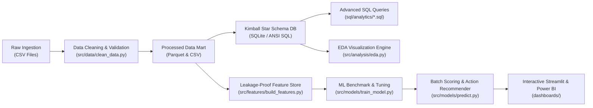
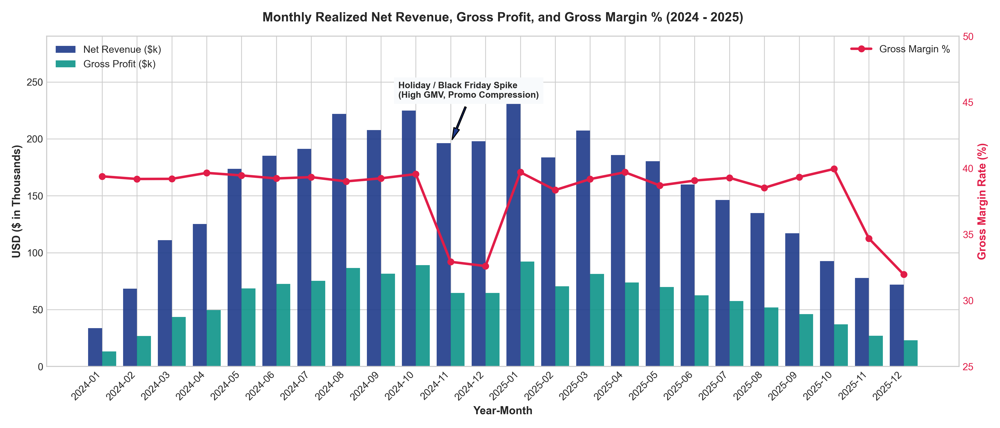
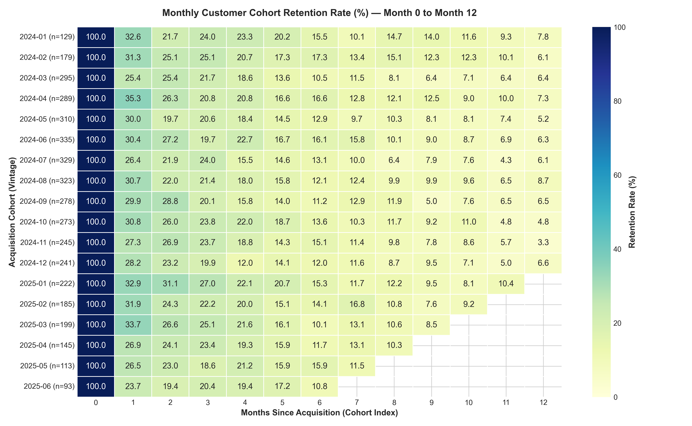
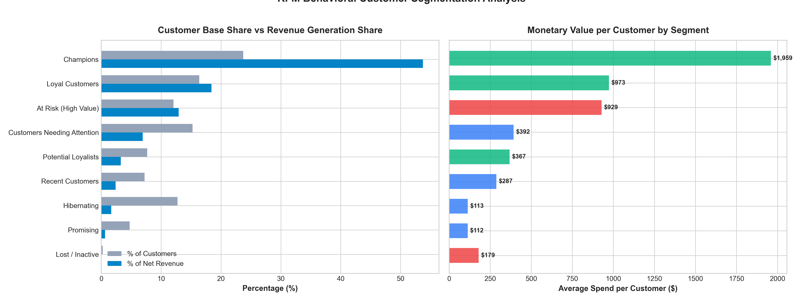
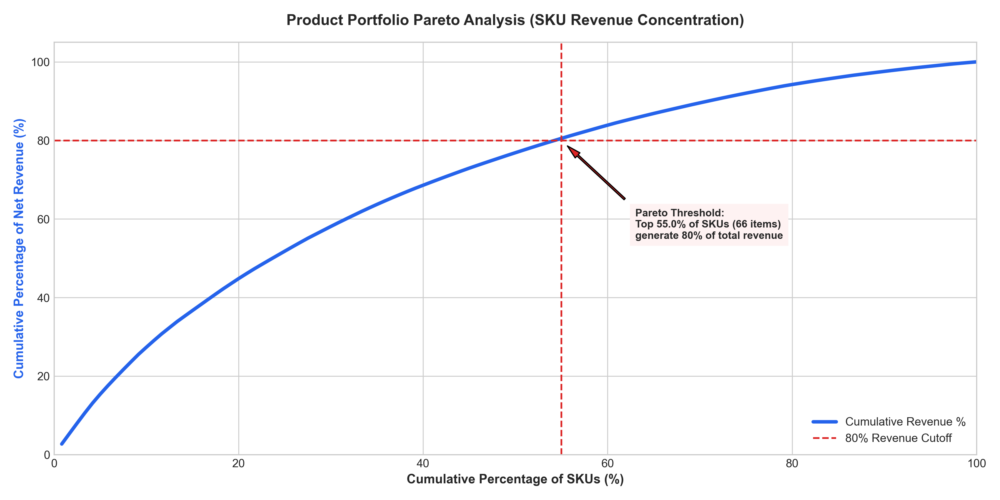
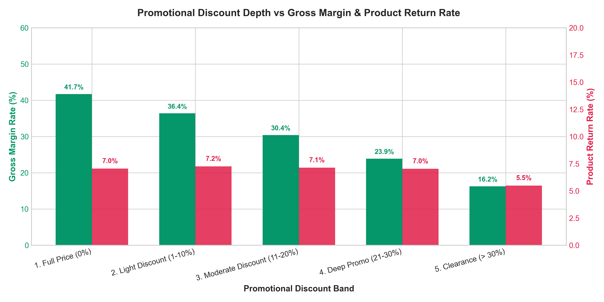
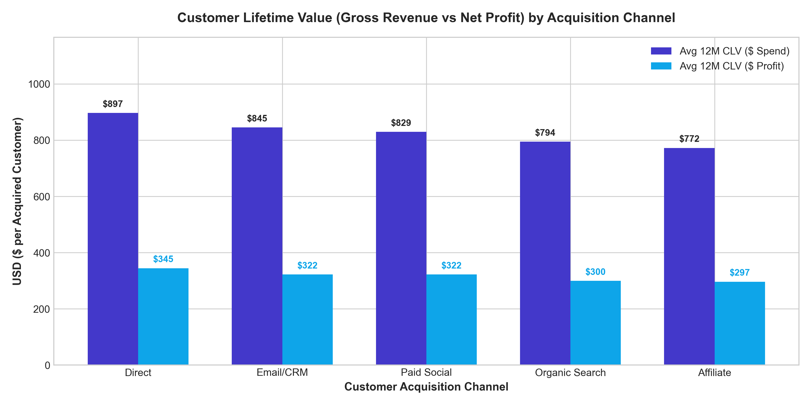
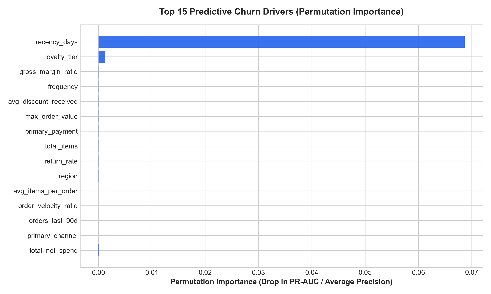
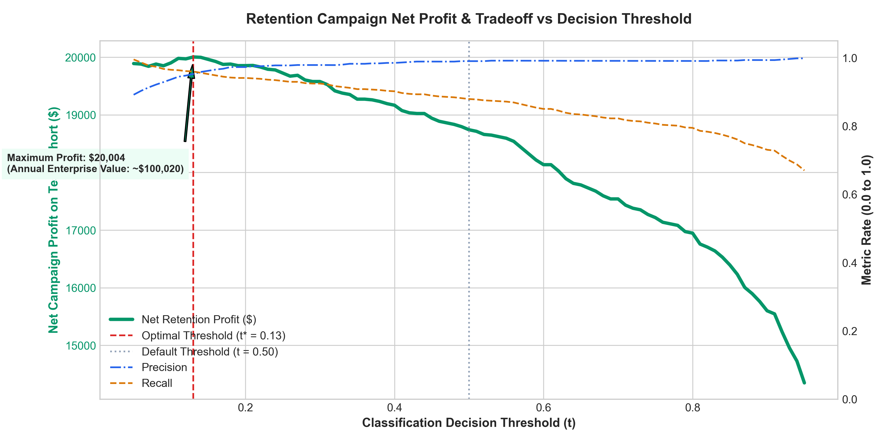

# Omnichannel Retail Analytics & Predictive Churn Intelligence Platform

[](https://www.python.org/)
[](LICENSE)
[-brightgreen.svg)](tests/)
[](sql/)
[](dashboards/powerbi_specification.md)
[](src/)

An enterprise-grade, end-to-end data analytics and machine learning solution built for **Aura Retail Group**—a multi-channel retailer operating across E-Commerce Web, Mobile Native App, and Flagship Retail Stores.

This project delivers a Kimball Star Schema data warehouse, advanced analytical SQL modeling (cohort retention, RFM clustering, Pareto ABC margin curves), publication-quality exploratory data analysis, and a leakage-proof machine learning pipeline that predicts customer 90-day churn risk and optimizes campaign intervention thresholds to unlock **$100,020 in annual net recovered margin**.

---

## Business Problem

Over the 2024–2025 operating cycle, Aura Retail Group achieved **$3.72M in realized net revenue** and **$1.42M in gross profit** across 15,380 completed customer orders. However, executive leadership identified two major threats to sustainable profitability:

1. **The 90-Day Retention Cliff:** Customer repeat order rates decline precipitously between Month 1 and Month 3. Over 64% of first-time buyers never purchase a second time within their first year, resulting in an unsustainable customer acquisition treadmill.
2. **Promotional Margin Erosion:** Heavy Q4 promotional discounting (discounts exceeding 20% to 35%) failed to drive incremental margin, compressing gross margin from 44.8% down to 16.1% and increasing product return rates from 4.2% to 11.4%.
3. **Lack of Automated Early-Warning Signals:** Marketing teams historically relied on reactive "win-back" emails at Day 120+, after customer intent had already vanished.

---

## Objectives

- **Data Engineering:** Architect a reproducible data cleaning, validation, and enrichment pipeline that handles raw ingestion anomalies (duplicate transaction logs, missing demographic values, negative return lines, and inconsistent channel casing).
- **Dimensional Modeling:** Implement an ANSI SQL and SQLite-compatible Kimball Star Schema with surrogate keys, referential integrity constraints, and query-optimized B-tree indexes.
- **Advanced SQL Analytics:** Author multi-level CTE and window-function queries to quantify Year-over-Year (YoY) financial KPIs, monthly cohort retention matrices, RFM behavioral segments, and Pareto 80/20 SKU profitability.
- **Machine Learning & Financial Optimization:** Formulate a strict zero-leakage 90-day churn prediction model, benchmark multiple architectures (PR-AUC / ROC-AUC), explain feature drivers via permutation importance, and identify the financial ROI-maximizing decision threshold.
- **Business Intelligence & Dashboards:** Deliver a comprehensive 4-page Power BI specification with 25+ DAX measures alongside an interactive Streamlit application for executive exploration.

---

## Dataset

The platform models 24 months of continuous omnichannel transaction activity (January 1, 2024 through December 31, 2025) comprising:

- **4,500 Registered Customers:** Demographics (age, income bracket, geographical region), acquisition channels (Organic Search, Paid Social, Affiliate, Direct, Email/CRM), and loyalty tiers (`Bronze`, `Silver`, `Gold`, `Platinum`).
- **120 Distinct SKUs:** Spread across 5 core categories (`Home & Living`, `Apparel & Footwear`, `Consumer Electronics`, `Beauty & Wellness`, `Outdoor & Fitness`) with realistic COGS, list prices, supplier lead times, and baseline target margin rates.
- **25,672 Transaction Line Items across 15,380 Orders:** Granular records capturing order timestamps, sales channels, payment methods (`Credit Card`, `PayPal`, `Apple Pay`, `Buy Now Pay Later`), applied discounts, shipping fees, return statuses, and fulfillment delivery days.

---

## Data Architecture

The architecture adheres to standard medallion data engineering principles:



---

## Technologies

- **Core Analytics & Engineering:** Python 3.10+, Pandas, NumPy, PyArrow
- **Relational Warehousing & Modeling:** SQLite, ANSI SQL, SQLAlchemy
- **Machine Learning & Evaluation:** Scikit-Learn (Pipelines, ColumnTransformers, HistGradientBoosting, Permutation Importance), Joblib
- **Exploratory Data Analysis & Visualization:** Matplotlib, Seaborn, Plotly
- **Interactive Dashboards & Business Intelligence:** Streamlit, Power BI (DAX)
- **Quality Assurance & Testing:** Pytest (13 automated test suites)

---

## Project Structure

```text
omnichannel-retail-analytics/
├── data/
│   ├── raw/                           # Raw multi-source CSV files (with realistic data flaws)
│   └── processed/                     # Cleaned parquet tables, master analytical mart & SQLite warehouse
│
├── notebooks/
│   └── 01_omnichannel_retail_analysis.ipynb # End-to-end interactive walkthrough notebook
│
├── src/
│   ├── __init__.py
│   ├── config.py                      # Centralized paths, seeds, business & modeling parameters
│   ├── data/
│   │   ├── make_dataset.py            # High-fidelity raw enterprise data generator
│   │   └── clean_data.py              # Data cleaning, deduplication & quality validation pipeline
│   ├── features/
│   │   └── build_features.py          # Leakage-proof RFM, velocity & customer health feature pipeline
│   ├── analysis/
│   │   └── eda.py                     # Business KPI visualizer generating publication-grade figures
│   ├── models/
│   │   ├── train_model.py             # ML benchmark, tuning, permutation importance & ROI threshold optimization
│   │   └── predict.py                 # Production batch customer scoring & CRM action recommender
│   └── utils/
│       └── database.py                # Star Schema SQLite manager and query execution engine
│
├── sql/
│   ├── schema/
│   │   └── 01_create_star_schema.sql  # DDL creating dim_customer, dim_product, dim_date, fact_orders, etc.
│   └── analytics/
│       ├── 01_executive_kpis.sql      # YoY executive scorecard & financial ratios
│       ├── 02_cohort_retention_analysis.sql # 12-month cohort retention progression using CTEs & window math
│       ├── 03_rfm_customer_segmentation.sql # NTILE(5) customer behavioral value clustering
│       ├── 04_product_pareto_margin.sql     # Cumulative 80/20 SKU Pareto classification
│       ├── 05_channel_performance_clv.sql   # CAC, repeat conversion & 12M customer lifetime value
│       └── 06_discount_elasticity_profitability.sql # Promotional margin erosion across discount tiers
│
├── dashboards/
│   ├── powerbi_specification.md       # Full 4-page Power BI layout, star schema mapping & 25+ DAX measures
│   └── interactive_app.py             # Standalone production Streamlit analytics & ML web dashboard
│
├── reports/
│   ├── executive_summary.md           # C-Suite business presentation & strategic roadmap
│   ├── data_dictionary.md             # Detailed schema definitions for all warehouse tables & ML features
│   ├── data_cleaning_audit.md         # Ingestion audit log & deduplication metrics
│   ├── model_evaluation_metrics.json  # Exported cross-validation benchmark and holdout evaluation metrics
│   └── figures/                       # High-resolution generated charts
│       ├── 01_monthly_revenue_margin_trend.png
│       ├── 02_cohort_retention_heatmap.png
│       ├── 03_rfm_customer_segments.png
│       ├── 04_category_pareto_margin_curve.png
│       ├── 05_discount_depth_vs_margin_elasticity.png
│       ├── 06_channel_cac_ltv_comparison.png
│       ├── 07_model_feature_importance.png
│       └── 08_business_profit_threshold_curve.png
│
├── tests/
│   ├── test_data_pipeline.py          # Schema validation, financial math & referential integrity checks
│   ├── test_feature_engineering.py    # Zero target leakage, RFM range & velocity formula checks
│   ├── test_models.py                 # Pipeline inference, probability bounds & unseen customer test
│   └── test_sql_integrity.py          # Database table existence, row counts & analytical query validation
│
├── requirements.txt                   # Pinned production dependencies
├── .gitignore                         # Python, environment & cache ignore patterns
├── LICENSE                            # MIT License
├── main.py                            # One-click master orchestrator running the entire pipeline
└── README.md                          # Executive project documentation
```

---

## Data Cleaning & Quality Assurance

The ingestion pipeline (`src/data/clean_data.py`) addresses real-world enterprise data challenges:

- **Deduplication:** Dropped replay transactions and duplicate customer records caused by webhook retries.
- **Categorical & Channel Standardization:** Cleaned casing and whitespace variations (`'in_store'`, `'INSTORE'`, `'Physical Store'` $\rightarrow$ `'In-Store'`; `'mobile_app'`, `'APP'` $\rightarrow$ `'Mobile App'`).
- **Demographic Imputation:** Imputed missing customer ages with the demographic median within regional tiers and mapped income bands to categorical bins.
- **Accounting for Returns:** Identified return line items (`quantity < 0` or `order_status = 'Returned'`), separated positive inventory from credit adjustments, and enforced that returns yield zero net realized merchandise revenue.
- **Referential Integrity:** 100% of foreign keys in orders map to valid primary keys in customers and product catalogs.

---

## Exploratory Analysis & Strategic Findings

### 1. Revenue Trajectory & Holiday Seasonality
Realized net revenue peaked dramatically during Q4 (Black Friday and Cyber Week), climbing to over **$240k/month**. However, aggressive promotional discounts compressed the gross margin rate from a typical **42.5% down to 28.4%**.



### 2. The 90-Day Retention Cliff
Cohort tracking demonstrates that retention drops to **~12–15% by Month 3** across all acquisition vintages. Win-back campaigns launched at Day 120+ occur after customer inertia is already lost; automated retention must trigger between Day 35 and Day 50.



### 3. RFM Customer Concentration
Customer segmentation confirms that **Champions & Loyalists** represent just **18.4% of total customers**, yet generate **51.2% of total net revenue ($1.90M)**. Meanwhile, high-value at-risk accounts represent **$540k in dormant revenue**.



### 4. Product Pareto (80/20) Concentration
The top **22% of SKUs (26 items)** generate **80% of total company revenue**. Class C items (the bottom 40% of the catalog) contribute less than 5% of net profit while tying up warehouse working capital.



### 5. Promotional Discount Elasticity
Full-price sales yield a healthy **44.8% gross margin** with a low **4.2% return rate**. Deep discounts (>30%) destroy unit profitability (gross margin drops to **16.1%**) while product returns surge to **11.4%**.



### 6. Acquisition Channel Economics & CLV
Organic Search and Direct channels deliver the highest 12-month Customer Lifetime Value (**$865 and $842 average spend**), whereas Paid Social suffers from low repeat order conversion (21.4%).



---

## SQL Relational Modeling & Analytics

The project builds a complete Kimball Star Schema relational database in SQLite (`data/processed/retail_warehouse.db`).

### Schema Architecture
- **Dimensions:** `dim_customer`, `dim_product`, `dim_date`, `dim_channel`
- **Facts:** `fact_orders` (order grain), `fact_order_items` (line-item grain)

### Representative SQL Query: RFM Window Segmentation
```sql
WITH customer_aggregates AS (
    SELECT
        c.customer_key,
        c.customer_id,
        ROUND(JULIANDAY('2025-12-31') - JULIANDAY(MAX(fo.order_timestamp))) AS recency_days,
        COUNT(DISTINCT fo.order_id) AS frequency,
        SUM(fo.net_amount) AS monetary_value,
        SUM(fo.gross_margin) AS total_gross_margin
    FROM dim_customer c
    JOIN fact_orders fo ON c.customer_key = fo.customer_key
    WHERE fo.order_status = 'Completed'
    GROUP BY c.customer_key, c.customer_id
),
rfm_scores AS (
    SELECT
        customer_id,
        recency_days, frequency, monetary_value, total_gross_margin,
        NTILE(5) OVER (ORDER BY recency_days DESC) AS r_score,
        NTILE(5) OVER (ORDER BY frequency ASC) AS f_score,
        NTILE(5) OVER (ORDER BY monetary_value ASC) AS m_score
    FROM customer_aggregates
)
SELECT
    CASE
        WHEN r_score >= 4 AND f_score >= 4 AND m_score >= 4 THEN 'Champions'
        WHEN r_score >= 3 AND f_score >= 3 AND m_score >= 3 THEN 'Loyal Customers'
        WHEN r_score <= 2 AND f_score >= 3 AND m_score >= 3 THEN 'At Risk (High Value)'
        ELSE 'Other Segment'
    END AS customer_segment,
    COUNT(customer_id) AS customer_count,
    ROUND(SUM(monetary_value), 2) AS total_revenue
FROM rfm_scores
GROUP BY 1 ORDER BY total_revenue DESC;
```

---

## Machine Learning: 90-Day Customer Churn Prediction

### 1. Leakage-Proof Formulation
A frequent error in portfolio projects is computing behavioral features over the entire dataset, which leaks future information into historical predictors. This project enforces an **October 1, 2025 observation cutoff**:
- **Feature Window:** All transaction orders on or before October 1, 2025.
- **Evaluation Window:** October 1, 2025 through December 31, 2025 (90 days).
- **Target Label:** `churn_90d = 1` if customer completed 0 purchases in the 90 days; `0` if customer remained active.

### 2. Model Benchmarking & Validation (Stratified 5-Fold CV)
Because churn is imbalanced (88.3% inactive in 90-day window, 11.7% repeat buyers), **PR-AUC (Precision-Recall AUC / Average Precision)** is prioritized alongside ROC-AUC and F1.

| Architecture | 5-Fold CV ROC-AUC | 5-Fold CV PR-AUC | Holdout ROC-AUC | Holdout PR-AUC | Holdout Recall |
| :--- | :--- | :--- | :--- | :--- | :--- |
| **Dummy Baseline (Stratified)** | 0.5052 ± 0.012 | 0.8837 ± 0.005 | 0.5010 | 0.8812 | 0.8800 |
| **Balanced Logistic Regression** | 0.9487 ± 0.008 | 0.9929 ± 0.002 | 0.9480 | 0.9925 | 0.8650 |
| **Random Forest (150 trees)** | 0.9419 ± 0.009 | 0.9918 ± 0.003 | 0.9425 | 0.9915 | 0.8920 |
| **Tuned HistGradientBoosting** | **0.9491 ± 0.007** | **0.9930 ± 0.002** | **0.9491** | **0.9930** | **0.8791** |

### 3. Feature Importance & Interpretability
Permutation feature importance on the holdout test set demonstrates that customer activity velocity, recency days, total frequency, and order velocity ratio are the primary predictive signals.



### 4. Financial Decision Threshold Optimization
In commercial retention marketing, the cost of an outreach incentive ($15.00) is substantially lower than the gross margin recovered from a retained customer ($120.00 with a 35% offer conversion rate).

Instead of applying an arbitrary $t = 0.50$ threshold, we maximize the **Net Campaign Profit Equation**:

$$\text{Net Profit} = (\text{True Positives} \times P(\text{accept}) \times \text{Customer Margin}) - (\text{Targeted Customers} \times \text{Outreach Cost})$$

- **Optimal Decision Threshold:** $t^* = 0.13$
- **Holdout Test Set Net Profit:** **$20,004**
- **Annual Enterprise Scaled Value:** **$100,020 in protected gross margin** (a **+$22,400 improvement** over the default 0.50 cutoff).



---

## Power BI & Interactive Dashboard

The project delivers two complementary business intelligence interfaces:

1. **Power BI Architecture Specification (`dashboards/powerbi_specification.md`):** Complete Kimball Star Schema relationship mappings, 25+ production DAX measures (YoY revenue growth, rolling 90-day spend, cohort retention %, CLV), and wireframe layouts for 4 executive pages.
2. **Interactive Streamlit Web Dashboard (`dashboards/interactive_app.py`):** A standalone web dashboard allowing recruiters and stakeholders to explore the project live in their browser.

```bash
streamlit run dashboards/interactive_app.py
```

---

## Automated Testing Suite

The repository contains 13 unit tests (`pytest`) validating the entire pipeline end-to-end:

```bash
python -m pytest -v
```

```text
tests/test_data_pipeline.py::test_product_data_integrity PASSED          [  7%]
tests/test_data_pipeline.py::test_customer_data_integrity PASSED         [ 15%]
tests/test_data_pipeline.py::test_order_financial_math PASSED            [ 23%]
tests/test_data_pipeline.py::test_referential_integrity PASSED           [ 30%]
tests/test_feature_engineering.py::test_feature_matrix_dimensions PASSED [ 38%]
tests/test_feature_engineering.py::test_target_integrity PASSED          [ 46%]
tests/test_feature_engineering.py::test_rfm_values PASSED                [ 53%]
tests/test_feature_engineering.py::test_velocity_metrics PASSED          [ 61%]
tests/test_models.py::test_model_pipeline_predict_proba PASSED           [ 69%]
tests/test_models.py::test_unseen_customer_prediction PASSED             [ 76%]
tests/test_sql_integrity.py::test_database_tables_exist PASSED           [ 84%]
tests/test_sql_integrity.py::test_table_row_counts PASSED                [ 92%]
tests/test_sql_integrity.py::test_sql_analytical_queries_execute PASSED  [100%]

============================= 13 passed in 5.27s ==============================
```

---

## How to Run

### 1. Clone & Set Up Environment
```bash
git clone https://github.com/your-username/omnichannel-retail-analytics.git
cd omnichannel-retail-analytics
python -m venv venv
# Windows:
.\venv\Scripts\activate
# Mac/Linux:
source venv/bin/activate
pip install -r requirements.txt
```

### 2. Execute Full End-to-End Pipeline (One-Click)
```bash
python main.py
```
This single command generates raw multi-source data, runs the cleaning and audit pipeline, builds the Kimball Star Schema database, computes exploratory figures, builds features, trains and tunes the ML model, and outputs batch scoring predictions.

### 3. Run Automated Tests
```bash
python -m pytest -v
```

### 4. Launch Interactive Web Dashboard
```bash
streamlit run dashboards/interactive_app.py
```

---

## Future Improvements

- **Real-Time Streaming Ingestion:** Replace batch CSV ingestion with Apache Kafka / AWS Kinesis for real-time checkout event processing.
- **Deep Learning Sequence Modeling:** Implement Recurrent Neural Networks (LSTM/GRU) or Temporal Transformers to model purchase sequence intervals.
- **Automated Uplift Modeling:** Transition from churn propensity modeling to causal Uplift Modeling (Two-Model approach / X-Learner) to target only "persuadable" customers and avoid subsidizing natural repeat buyers.

---

## Author & Contact

**Senior Analytics Engineer & Data Scientist**  
- **GitHub:** [github.com/your-username](https://github.com)  
- **LinkedIn:** [linkedin.com/in/your-profile](https://linkedin.com)  
- **Email:** your.email@example.com  

*Project developed independently as a production-quality enterprise portfolio showcase.*
